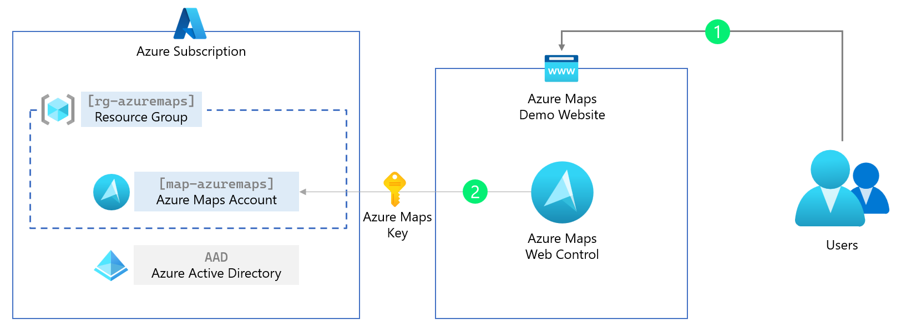

# Azure Maps Web Application Authentication

One of the requirements when building a business application, which may give access to private business data, is that only authenticated employees or agents be able to see that data. So how can you use [Azure Maps](https://azuremaps.com/) in combination with authentication and authorization to ensure only the people that should be allowed have access?

Our [Azure Maps docs](https://docs.azuremaps.com/) describe in detail [many different authentication scenarios](https://docs.microsoft.com/azure/azure-maps/azure-maps-authentication) but the complexity can make it seem difficult to implement. This blog post will focus on our most requested authentication scenario for Azure Maps. Use the following step by step guidance to have a .NET web application embedded Azure Maps web control where only authenticated users can see the website and use the map.

## Prerequisites

In this article, we use the following resources:

* .NET 7.0 and the C# programming language. You can download, and install the latest version of .NET from https://dot.net/
* To make it easier to edit source code, we also recommend installing Visual Studio Code Edition, which is a lightweight but powerful source code editor from Microsoft https://code.visualstudio.com/
* Before you can use Azure Maps, you will need to sign up for a free Azure subscription, at https://azure.microsoft.com/free
* And finally, install the Azure Command-Line Interface (CLI) tools. Read here [How to install the Azure CLI](https://docs.microsoft.com/cli/azure/install-azure-cli).

## Step 1. Basic Web Application with Azure Maps

Let's start with a basic .NET web application and Azure Maps. No authentication yet, that will come in the next paragraph. This first step will use an Azure Maps Key (a ‘shared Key authentication’ or subscription key) that should **not** be used in production. An Azure Maps Key has complete control over your Azure Maps resource. In the next paragraph, we will remove this key and replace this with managed identities for Azure resources.

Create a folder, we called ours `AzureMapsDemo`, and add a new web application to it. Then open the newly created web application in Visual Studio Code. Start PowerShell (or any other terminal) and enter the following commands:

```cmd
dotnet new mvc -lang C# -n AzureMapsDemo -f net7.0
cd .\AzureMapsDemo
code .
```

Next, we need to add the Azure Maps web control to the Home view, open the file `Views/Home/index.cshtml`, and replace all the content with:

```html
@{
    ViewData["Title"] = "Home Page";
}

<div class="text-center">
    <h1 class="display-4">Azure Maps</h1>
    <p>Learn about <a href="https://docs.microsoft.com/azure/azure-maps/">building Azure Maps apps with ASP.NET Core</a>.</p>
</div>

<div id="myMap" style="width:100%;min-width:290px;height:600px;"></div>

@section Scripts
{
    <link rel="stylesheet" href="https://atlas.microsoft.com/sdk/javascript/mapcontrol/2/atlas.min.css" />
    <script src="https://atlas.microsoft.com/sdk/javascript/mapcontrol/2/atlas.min.js"></script>

    <script>
        var map;

        // Initialize a map instance.
        map = new atlas.Map('myMap', {
            center: [-122.33, 47.6],
            zoom: 12,
            style: 'satellite_road_labels',
            view: 'Auto',

            // Add authentication details for connecting to Azure Maps.
            authOptions: {
                authType: 'subscriptionKey',
                subscriptionKey: '[YOUR_AZURE_MAPS_KEY]'
            }
        });

        // Wait until the map resources are ready.
        map.events.add('ready', function() {
            // Add your post map load code here.
        });
    </script>
}
```

As you can see, we need a subscription key for Azure Maps before starting the web application and using the map. In the next step, we are creating an Azure resource group and adding a new Azure Maps Account. Then we extract the Azure Maps Primary Key from this Azure Maps Account, which we use in our Home view.

1.1 Login into your Azure subscription and save the Azure subscription Id, we need this for later.

```cmd
az login
```

1.2 (Optional) Select the subscription where you would like to create the Azure Maps Account.

```cmd
az account set --subscription "<your subscription>"
```

1.3 Create a resource group, and change the name and the location for your needs.

```cmd
az group create -l westeurope -n rg-azuremaps
```

1.4 Create the Azure Maps Account, and accept the terms and conditions. Save the uniqueId for later.

```cmd
az maps account create -n map-azuremaps -g rg-azuremaps -s "G2" --kind "Gen2"
```

1.5 Now we can extract the Azure Maps Primary Key and add it to the Home view in our web application.

```cmd
az maps account keys list -n map-azuremaps -g rg-azuremaps
```

1.6 Replace the `[YOUR_AZURE_MAPS_KEY]` in the file `Views/Home/index.cshtml` with the Azure Maps Primary Key we just listed in step 1.5.

1.7 Now we can run and test our AzureMapsDemo web application.

```cmd
dotnet run
```



## Step 2. Managed identities for Azure Maps

In this paragraph, we are removing the ‘shared Key authentication’ (the Azure Maps subscription key) and replacing this with a more secure and production ready managed identities for Azure Maps.

> Managed identities for Azure resources provide Azure services with an automatically managed application-based security principal that can authenticate with Azure AD. With Azure role-based access control (Azure RBAC), the managed identity security principal can be authorized to access Azure Maps services.

This means that the web application can request a short-lived token to get access to Azure Maps from Azure Active Directory (AAD). Because this is managed, we do not need to know any passwords or create users. However, to get this token back to the client (the Azure Maps Web Controls runs in the users’ browser), we need to create a simple token proxy API in our web application to forward this token.

We start by creating an Azure Web App where our web application will be hosted and running. This Azure Web App then needs to have rights to get a token for Azure Maps, which we will forward using the token proxy API we create in the below steps.

2.1 Create an app service plan and web app, and change the unique name and the location for your needs.

```cmd
az appservice plan create -g rg-azuremaps -n plan-azuremaps -l westeurope

az webapp create -g rg-azuremaps -p plan-azuremaps -n web-azuremaps -r "dotnet:6"
```

2.2 Next, we create a system-assigned identity for this web app. When finished, we are presented with the `principalId`, we need this in the next step. To make it simple, you can see the system-assigned identity as an account Azure manages.

```cmd
az webapp identity assign -n web-azuremaps -g rg-azuremaps
```

2.3 Now that we have the `principalId` (use this in the below command) for this system-assigned identity, we can assign the role (what can this system-assigned identity do and access). In this step, we assign the role of [Azure Maps Data Reader](https://docs.microsoft.com/azure/azure-maps/azure-maps-authentication#picking-a-role-definition) to this system-assigned identity, which means that this system-assigned identity can only read and not modify or delete data from your Azure Maps account. You already see this is way more secure than the plain Azure Maps key, which has all the rights to do everything. We also need the `[YOUR_AZURE_SUBSCRIPTION_ID]` from the first step.

```cmd
az role assignment create --assignee "[PRINCIPAL_ID]" --role "Azure Maps Data Reader" --scope "/subscriptions/[YOUR_AZURE_SUBSCRIPTION_ID]/resourceGroups/rg-azuremaps/providers/Microsoft.Maps/accounts/map-azuremaps"
```

> **Hint** to get your Azure subscription Id use the following command: `az account subscription list`

2.4 To get the access token from Azure Active Directory (AAD) back to the client (the web browser), we will create a simple proxy API forwarding this access token. We start by creating an API controller in our web application and adding the `GetAzureMapsToken()` method.

2.5 First, we must add the **Azure Identity** NuGet package to our web application.

```cmd
dotnet add package Azure.Identity
```

2.6 Next, we create a new `ApiController.cs` file under the folder **Controllers**. This new `ApiController.cs` file will have a method `GetAzureMapsToken()` that is acting like a proxy for our access token. Read [here](https://docs.microsoft.com/aspnet/core/tutorials/first-mvc-app/adding-controller) more about Controllers in a MVC web application.

```csharp
using Azure.Core;
using Azure.Identity;
using Microsoft.AspNetCore.Mvc;

namespace AzureMapsDemo.Controllers;

public class ApiController : Controller
{
    private static readonly DefaultAzureCredential tokenProvider = new();

    public async Task<IActionResult> GetAzureMapsToken()
    {
        var accessToken = await tokenProvider.GetTokenAsync(
            new TokenRequestContext(new[] { "https://atlas.microsoft.com/.default" })
        );

        return new OkObjectResult(accessToken.Token);
    }
}
```

2.7 Now that we have our token API proxy, we only need to change the authentication options for the Azure Maps Web Control. Replace in the file `Views/Home/index.cshtml` the authOptions with the following:

```js
// Add authentication details for connecting to Azure Maps.
authOptions: {
    // Use Azure Active Directory authentication.
    authType: 'anonymous',
    // Your Azure Maps client id for accessing your Azure Maps account.
    clientId: '[YOUR_AZUREMAPS_CLIENT_ID]',
    getToken: function(resolve, reject, map) {
        // URL to your authentication service that retrieves
        // an Azure Active Directory Token.
        var tokenServiceUrl = "/api/GetAzureMapsToken";

        fetch(tokenServiceUrl).then(r => r.text()).then(token => resolve(token));
    }
}
```

2.8 We also need to update the `clientId` we saved when we created the Azure Maps account. (Optional) To get the Azure Maps Client Id again, use the value of `uniqueId` from:

```cmd
az maps account show -n map-azuremaps -g rg-azuremaps
```


2.9 Now we can build and deploy our web application that uses managed identities for Azure Maps. We first build and create a release package.

```cmd
dotnet publish --configuration Release

Compress-Archive -Path bin\Release\net6.0\publish\* -DestinationPath release1.zip
```

2.10 Then we publish our release package to the Azure Web App.

```cmd
az webapp deployment source config-zip -g rg-azuremaps -n web-azuremaps --src release1.zip
```

2.11 Open a web browser and navigate to the https://web-azuremaps.azurewebsites.net/ where the **web-azuremaps** subdomain is your unique name when creating the Azure Web App. The application looks like this:


2.12.	(Optional) We can also navigate to the token proxy API https://web-azuremaps.azurewebsites.net/api/GetAzureMapsToken, copy the token, and past this in the https://jwt.ms/ tool to decode and inspect the token.

## Step 3. Protecting the web application and the Azure Maps token proxy API

The web application we built in the last paragraph uses managed identities, and the Azure Maps Web Control uses the access token. Unfortunately, the web application and token proxy API are still accessible to everybody. Therefore, in this paragraph, we are adding the Azure Active Directory (AAD) Authentication to the web application and the token proxy API, so that only authenticated users can view the web application and use the Azure Maps Web Control in a secure way. 

3.1 We start by registering an application in the Azure Active Directory, and we need this application registration later to give access to the web application and token proxy API.

```cmd
az ad app create --display-name "Azure Maps Demo App" --web-redirect-uris https://web-azuremaps.azurewebsites.net/signin-oidc --enable-access-token-issuance true --enable-id-token-issuance true --sign-in-audience AzureADMyOrg
```

3.2 We need to add four Identity and Authentication NuGet packages to our web application.

```cmd
dotnet add package Microsoft.Identity.Web
dotnet add package Microsoft.Identity.Web.UI
dotnet add package Microsoft.AspNetCore.Authentication.JwtBearer
dotnet add package Microsoft.AspNetCore.Authentication.OpenIdConnect
```

3.3 Next, we need to add the `[Authorize]` attribute to every controller in our web application. Below is our token API proxy controller as an example. Do not forget to do this also for the Home controller! 

```csharp
using Azure.Core;
using Azure.Identity;
using Microsoft.AspNetCore.Mvc;
using Microsoft.AspNetCore.Authorization;

namespace AzureMapsDemo.Controllers;

[Authorize]
public class ApiController : Controller
{
    ...
```

3.4 In the program startup file `Program.cs` we need to add the Authentication and Authentication logic. Replace all the default code in the `Program.cs` file with the following:

```csharp
using Microsoft.AspNetCore.Authentication;
using Microsoft.AspNetCore.Authentication.OpenIdConnect;
using Microsoft.AspNetCore.Authorization;
using Microsoft.AspNetCore.Mvc.Authorization;
using Microsoft.Identity.Web;
using Microsoft.Identity.Web.UI;

var builder = WebApplication.CreateBuilder(args);

// Add services to the container.
builder.Services.AddAuthentication(OpenIdConnectDefaults.AuthenticationScheme)
    .AddMicrosoftIdentityWebApp(builder.Configuration.GetSection("AzureAd"));

builder.Services.AddAuthorization(options =>
{
    options.FallbackPolicy = options.DefaultPolicy;
});

builder.Services.AddControllersWithViews(options =>
{
    var policy = new AuthorizationPolicyBuilder()
        .RequireAuthenticatedUser()
        .Build();
    options.Filters.Add(new AuthorizeFilter(policy));
});
builder.Services.AddRazorPages()
    .AddMicrosoftIdentityUI();

var app = builder.Build();

// Configure the HTTP request pipeline.
if (!app.Environment.IsDevelopment())
{
    app.UseExceptionHandler("/Home/Error");
    // The default HSTS value is 30 days. You may want to change this for production scenarios, see https://aka.ms/aspnetcore-hsts.
    app.UseHsts();
}

app.UseHttpsRedirection();
app.UseStaticFiles();

app.UseRouting();

app.UseAuthentication();
app.UseAuthorization();

app.MapControllerRoute(
    name: "default",
    pattern: "{controller=Home}/{action=Index}/{id?}");
app.MapRazorPages();
app.MapControllers();

app.Run();
```

3.5 The last step before redeploying our secure web application is to add the details from our registered application in the Azure Active Directory into the configuration file. Open the `appsettings.json` file and replace this with:

```json
{
  "AzureAd": {
    "Instance": "https://login.microsoftonline.com/",
    "Domain": "[PUBLISHER_DOMAIN]",
    "TenantId": "[AAD_TENANT_ID]",
    "ClientId": "[APP_ID]",
    "CallbackPath": "/signin-oidc"
  },
  "Logging": {
    "LogLevel": {
      "Default": "Information",
      "Microsoft.AspNetCore": "Warning"
    }
  },
  "AllowedHosts": "*"
}
```

3.6 Replace the `[PUBLISHER_DOMAIN]` and `[APP_ID]` with the values we saved in step 1 when we registered the application. Your Azure Active Directory Tenant ID `[AAD_TENANT_ID]`, you can get with the following command:

```cmd
az account tenant list
```


3.7 Now we can build and deploy our web application that uses Azure Active Directory to login. We first build and create a release package.

```cmd
dotnet publish --configuration Release

Compress-Archive -Path bin\Release\net6.0\publish\* -DestinationPath release2.zip
```

3.8 Then we publish our release package to the Azure Web App.

```cmd
az webapp deployment source config-zip -g rg-azuremaps -n web-azuremaps --src release2.zip
```

3.9 Open a web browser and navigate to the https://web-azuremaps.azurewebsites.net/ where the **web-azuremaps** subdomain is your unique name when creating the Azure Web App. You are now prompted to log in with your work or school account (AAD) and give permissions.


3.10 A recommended last step is to disable the use of the Azure Maps Key authentication.

```cmd
az maps account update -n map-azuremaps -g rg-azuremaps --disable-local-auth true -s "G2"
```

## Conclusion

When we have done all the steps in this step-by-step article, you have a protected web application in combination with Azure Maps that uses of Azure Active Directory, Azure role-based access control ([Azure RBAC](https://docs.microsoft.com/azure/role-based-access-control/overview)), and [Azure Maps tokens](https://docs.microsoft.com/azure/azure-maps/azure-maps-authentication). I recommend that you read our [Authentication best practices](https://docs.microsoft.com/azure/azure-maps/authentication-best-practices) and Azure Maps documentation. Also the [Azure Maps Samples](https://samples.azuremaps.com/) website offers so great ideas, with source code on Github, and uses most of the steps described in this article. Happy coding!
